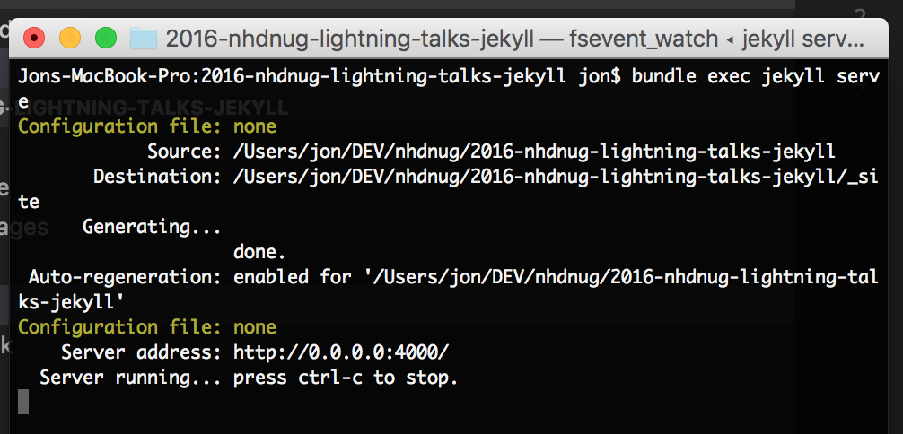
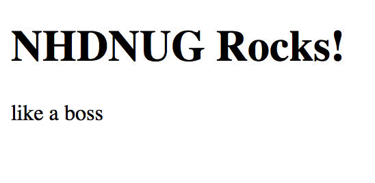
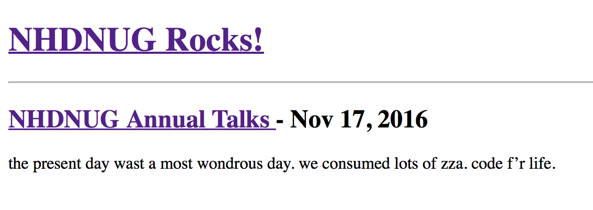
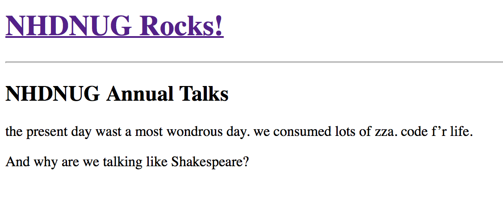
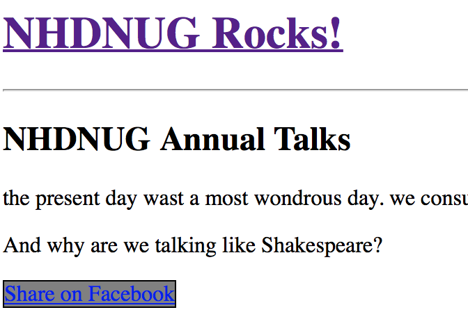

# 2016 NHDNUG Lightning Talks - Jekyll and Github Pages
This goes along with my talk at the 2016 North Houston .Net Users Group Lightning 
talks. It's an intro to Jekyll and GitHub pages.

## Before We Write Code
Before we get into writing code, let's clear up exactly what this talk is about.

It's about [Jekyll](https://jekyllrb.com) - A "simple, blog-aware, static site generator perfect for personal, project, or organization [web] sites."

 - Build a web site and host it without any databases. Static files aren't subject to SQL injection or Wordpress vulnerabilities!
 - Use templates and include files to make broad changes across a site in seconds.
 - Author content in HTML or [Markdown](https://en.wikipedia.org/wiki/Markdown).
 - Focus on what visitors care about - content and look&feel, without having to sweat if your site robust or scalable enough. Host on any number of Jekyll-aware hosts, push your static site to a CDN, or just host straight from GitHub using GitHub Pages.
 - Got a blog hosted on something else already? [Import it into Jekyll using one of the many importers](https://import.jekyllrb.com/docs/home/). I've used [wpXml2Jekyll](https://github.com/theaob/wpXml2Jekyll) before with success on a WordPress blog.

It's about [GitHub Pages](https://pages.github.com).

 - Build your site using Jekyll.
 - Host your site directly from your GitHub repository. Just edit, push, and your changes are live.
 - Make sure and abide by their [usage guidelines](https://help.github.com/articles/what-is-github-pages/).

**We're starting from scratch.** There are starter repos out there. Jekyll itself has a *new* command line option to get you a starter site. We aren't using these, as I'd like for you to understand Jekyll - *not just be able to use it*. Definitely explore these other options when you finish the tutorial though. Knowledge is power!

 
## Installing All the Things
Here's what you'll need installed:

 - [Ruby](https://www.ruby-lang.org/en/) - Jekyll runs on Ruby, but don't fret - you won't be writing any Ruby today.
 - [Git](https://git-scm.com) - GitHub Pages will publish your site from a Git repository. This tutorial will walk you through the basics of using Git for this.
 - [Jekyll](https://jekyllrb.com) - Gotta install Jekyll to use Jekyll.
 - A text editor. If you don't have a favorite, or want to try something new, I'd recommend [Visual Studio Code](https://code.visualstudio.com).

My demo will be shown from a Mac. *But wait Jon! This is a .Net users group! We all run Windows...* **No problem.** Everything I show here can be run from a Windows machine as well. Installing Ruby is a little more trouble on Windows, but not too much if you use [RubyInstaller](http://rubyinstaller.org). Oh... and .Net runs on Mac and Linux now. The times, they are a changin'.

## It's Code Time.
We're going to be focusing on getting a site built using Jekyll, ready to host on GitHub Pages - but we aren't going to push them to GitHub as part of this talk.

If you're interested in hosting your blog from GitHub, make sure you have a GitHub account.

Lastly, if you're on Mac all commands *should* work from the terminal. If you're on Windows, your best best is to run the commands from PowerShell, as it maps Unix-style commands to their equivalent Windows ones.

### Start a new Git Repo
 
1. Find a location on your local drive where you store dev projects.
2. Make a new directory for your site. If you're going to be hosting a blog on GitHub Pages, then name the directory "**username**.github.io" where **username** is your GitHub username. 

	```shell
	mkdir username.github.io
	```

3. Initialize the repo.

	```shell
	git init
	```

4. Add a .gitignore file

	```shell
	(On Mac/Linux)
	touch .gitignore
	
	(On Windows: PowerShell)
	echo $null >> .gitignore
	```

5. In your text editor of choice, add the following to the .gitignore file:

	```shell
	_site/
	.sass-cache/
	.jekyll-metadata

	```

6. Commit!

	```shell
	git add --all
	git commit -m "Initial Commit"	
	```
	
### Get Jekyll Working

1. Let's install the Jekyll Ruby gem into our project.

	```shell
	gem install jekyll bundler	
	```

2. Configure the gems used by Jekyll. Create a new file named Gemfile and put the following inside it. This will limit Jekyll to using only what GitHub Pages supports.

	```
	source "https://rubygems.org"
	
	gem "github-pages", group: :jekyll_plugins
	```
	
3. Now let's install/update the github-pages gem (and all the dependencies). You'll notice some new ones install, some get upgraded, and some get downgraded.

	```shell
	bundle install
	```

4. Let's get our first content put in the site. This will create an index.html with some awesome content.

	```shell
	echo "Hello World" > index.html
	```
	
5. Time to test! Run the following to build your site and host it from [http://localhost:4000	](http://localhost:4000).

	```shell
	bundle exec jekyll serve
	```
	
	Success! ...with warnings. We'll get to those.
	
	
	
	Open the web browser to [http://localhost:4000	](http://localhost:4000) and you'll see:
	
	
	
6. Time to commit, as this is definite progress.

	```shell
	git add --all
	git commit -m "Got Jekyll Working"	
	```

### Jekyll Configuration and Site Properties

1. Create a new file named _config.yml

	```shell
	echo "# Jekyll Settings" > _config.yml
	```
2. Open the _config.yml file.
3. When Jekyll builds the site, it includes nearly everything in the working directory in the output. Let's setup some exclusions. Add the following to the file:

	```yml
	exclude: 
	 - Gemfile 
	 - Gemfile.lock 
	 - LICENSE 
	 - .sass-cache
	```

4. We can define site-wide values to refer to in this file as well. Add the following to the file:

	```yml
	# Site Settings
	title: NHDNUG Rocks!
	description: like a boss
	```	
	
	Here's what the file should look like when you're done:

	```yml
	# Jekyll Settings
	exclude: 
	  - Gemfile 
	  - Gemfile.lock 
	  - LICENSE 
	  - .sass-cache
	
	# Site Settings
	title: NHDNUG Rocks!
	description: like a boss
	```

5. Finally, let's test out our site properties in the index.html file. We'll setup the *top matter* and add some HTML that references both site and page properties.

	```html
	---
	    title: "Home Page"
	---
	<!DOCTYPE html>
	<html>
	    <head>
	        <title>{{ site.title }} -  {{ page.title }}</title>
	        <meta name="description" content="{{ site.description }}" />
	    </head>
	    <body>
	        <h1>{{ site.title }}</h1>
	        <p>{{ site.description }}</p>
	    </body>
	</html>
	```	
	
6. Build the site.

	```shell
	bundle exec jekyll serve
	```

	Great! 
		

7. Time to commit. So far, we've got a working Jekyll site with site and page properties.

	```shell
	git add --all
	git commit -m "Jekyll Config and Site Properties"
	```
	
### Jekyll Templates and Posts
In order for us to focus on writing content and not HTML every time we want to create a page, we need to build some boilerplate HTML that wraps each of our pages. Jekyll calls these templates, and stores all of them inside a ```_layouts``` directory. They are then referred to by a ```layout``` property in individual pages and other templates.

We're going to be creating 2 templates, one for the overall branding and another for individual blog posts.

1. Create a _layouts directory

	```shell
	mkdir _layouts
	```
	
2. Create 2 template files in the _layouts directory: ```default.html``` and ```post.html```.
3. Copy the following into ```default.html```.

	```HTML
	<!DOCTYPE html>
	<html>
		<head>
			<meta charset="utf-8" />
			<title>{{ page.title }} - {{ site.title }}</title>
		</head>
		<body>
		<h1><a href="/">{{ site.title }}</a></h1>
		<hr />
		{{ content }}
		</body>
	</html>
	```

4. Copy the following into ```post.html```.	

	```HTML
	---
	layout: default
	---
	<article>
		<h1>{{ page.title }}</h1>
		{{ content }}
	</article>
	```

5. Time to add our first post. Create a ```_posts``` directory and then place a file named ```2016-11-17-nhdnug-annual-talks.md```. Place the following within it.

	```
	---
	layout: post
	title: NHDNUG Annual Talks
	date: 2016-11-17
	---
	the present day wast a most wondrous day. we consumed 
	lots of zza. code f'r life.
	
	And why are we talking like Shakespeare?
	```

6. We also need to adjust our index to display our posts. Replace what's in ```index.html``` with the following.

	```HTML
	---
	layout: default
	title: Home
	---
	
	<article>
        <h2>
            <a href="{{ post.url }}">
                {{ post.title }}
            </a>
            - {{ post.date | date: "%b %-d, %Y" }}
	    </h2>
        {{ post.excerpt }}
    </article>
	
	```

7. Time to test.

	```shell
	bundle exec jekyll serve
	```
	
	Index:
	
	
	Post:
	
	
	Looks pretty plain, but you get the idea.
	
### Jekyll Includes	

Often, you'll have a piece of code that needs to be used in multiple places; or it's just complex enough that you'd rather put it in its own file. This is what Jekyll Includes are for.

Let's build a simple share button in an include.

1. Start by creating a ```_includes``` directory.

	```shell
	mkdir _includes
	```

2. Now create a ```share-button.html``` file inside the directory.

	```shell
	echo " " > _includes/share-button.html
	```	
	
3. Place the following into the file:

	```HTML
	
	
	<div style="display: inline-block; background: grey; border: 1px solid black;">
	<a href="{{ share_url }}">Share on Facebook</a>
	</div>
	```	
	
4. Now, add the include to the post layout file ```post.html```, making sure to include the post url as an include parameter.

	```HTML
	---
	layout: default
	---
	<article>
	    <h1>{{ page.title }}</h1>
	    {{ content }}
	    
	</article>
		
	```	
	
5. Lastly, let's add a ```url``` property on the site object by adding it to the ```_config.yml``` file.

	```
	url: "http://example.com"
	```	
	
6. Time to test. Stop the running server, then start it back up.	

	```shell
	bundle exec jekyll serve
	```
	
	
	
	It's not the prettiest thing, but it's functional!
	
### The End

At this point, you've soon most of the core parts of Jekyll. With some content and a theme off the Internet, you too can have your blog hosted off GitHub Pages, with absolute control over the markup and the performance of static pages.	